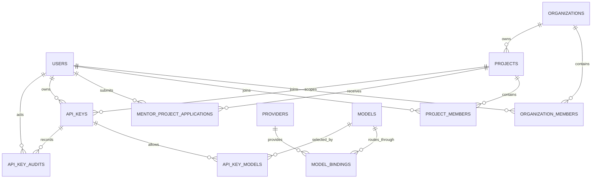

# Nebula 数据库设计

## 1. 文档范围

本文档定义 Nebula 首期 PostgreSQL 持久化契约，与 `internal/infrastructure/db/ent/schema` 和控制面事务实现对应。仓库提供显式 `cmd/migrate` 初始化入口，服务启动不自动迁移；Docker 本地环境通过一次性 `migrate` service 执行同一入口，成功退出后 backend 才启动。项目不迁移参考项目历史数据。

设计依据来自参考项目真实 Alembic Migration、SQLAlchemy Model、Controller、Schema 与网关路由。新系统是 greenfield replatforming，不兼容旧表结构。

## 2. 全局约束

| 项目 | 约束 |
| --- | --- |
| 数据库 | PostgreSQL |
| ORM | Ent |
| 主键 | 应用侧生成 UUIDv7 |
| 表名 | snake_case，无 `nebula_` 前缀 |
| 时间 | `timestamptz`，应用和数据库统一使用 UTC |
| 大小写不敏感文本 | PostgreSQL `citext`；未来迁移必须先启用 `citext` extension |
| 删除策略 | 首期资源不提供删除 API；外键使用 `RESTRICT`，资源通过状态启用或停用 |
| 软删除 | 不使用 `deleted_at` |
| 凭据 | 用户密码仅保存强密码哈希；供应商凭据加密后保存；API Key 明文只在领取时返回一次 |

首期明确不创建计费、余额、额度、用量、通知、模型市场价格、智能路由、验证码、refresh session、老师邀请或 SSE 事件表。验证码、refresh session、老师邀请和 SSE 事件存放在 Redis。

## 3. 枚举

| 枚举 | 值 |
| --- | --- |
| `user_role` | `student`, `mentor`, `teacher` |
| `user_status` | `pending_invite`, `active`, `disabled` |
| `resource_status` | `active`, `inactive` |
| `mentor_project_application_status` | `pending`, `approved`, `rejected`, `cancelled` |
| `model_category` | `text`, `image`, `audio`, `video`, `multimodal`, `embedding`, `rerank` |
| `model_status` | `pending_configuration`, `active`, `inactive` |
| `model_binding_adapter` | `openai_compatible`, `anthropic` |
| `api_key_status` | `pending_mentor`, `pending_teacher`, `approved`, `active`, `rejected`, `revoked` |
| `api_key_audit_action` | `mentor_approved`, `mentor_rejected`, `teacher_approved`, `teacher_rejected`, `mentor_revoked` |

## 4. 表结构

除特别说明外，所有 `id` 均为非空 UUIDv7 主键，`created_at` 和 `updated_at` 均为非空 `timestamptz`。

### 4.1 `users`

| 字段 | 类型 | 可空 | 默认值 | 约束与说明 |
| --- | --- | --- | --- | --- |
| `id` | uuid | 否 | UUIDv7 | 主键，不可变 |
| `name` | varchar(64) | 否 | - | 非空字符串 |
| `email` | citext | 否 | - | 最大 254 字符，全局唯一 |
| `password_hash` | varchar(255) | 否 | - | 密码哈希，敏感字段 |
| `role` | enum | 否 | - | `student/mentor/teacher`，创建后不可变 |
| `status` | enum | 否 | `active` | `pending_invite/active/disabled` |
| `created_at` | timestamptz | 否 | 当前时间 | 不可变 |
| `updated_at` | timestamptz | 否 | 当前时间 | 更新时刷新 |

索引：唯一索引 `email`；普通索引 `(role, status)`。

学生和导师可公开注册，创建后为 `active`。运行环境也可提供固定学生/导师测试账号，backend 启动时按规范化邮箱幂等创建 `active` 用户；若同邮箱用户已存在且角色一致则完全保留原记录，不同步姓名、密码或状态，角色冲突则拒绝启动。老师只能由首个老师初始化或老师邀请创建；邀请未激活时为 `pending_invite`。

### 4.2 `organizations`

| 字段 | 类型 | 可空 | 默认值 | 约束与说明 |
| --- | --- | --- | --- | --- |
| `id` | uuid | 否 | UUIDv7 | 主键 |
| `name` | citext | 否 | - | 最大 128 字符，全局唯一 |
| `description` | varchar(1024) | 是 | NULL | 组织说明 |
| `status` | enum | 否 | `active` | `active/inactive` |
| `created_at` | timestamptz | 否 | 当前时间 | 不可变 |
| `updated_at` | timestamptz | 否 | 当前时间 | 更新时刷新 |

索引：唯一索引 `name`；普通索引 `status`。不保存组织编码。

### 4.3 `organization_members`

| 字段 | 类型 | 可空 | 默认值 | 约束与说明 |
| --- | --- | --- | --- | --- |
| `id` | uuid | 否 | UUIDv7 | 主键 |
| `organization_id` | uuid | 否 | - | FK -> `organizations.id` |
| `user_id` | uuid | 否 | - | FK -> `users.id` |
| `created_at` | timestamptz | 否 | 当前时间 | 加入时间 |

索引：唯一索引 `(organization_id, user_id)`；普通索引 `user_id`。

该表只表示学生或导师当前属于某组织，不重复保存角色和状态。角色来自 `users.role`。老师拥有平台级权限，不写入此表。

### 4.4 `projects`

| 字段 | 类型 | 可空 | 默认值 | 约束与说明 |
| --- | --- | --- | --- | --- |
| `id` | uuid | 否 | UUIDv7 | 主键 |
| `organization_id` | uuid | 否 | - | FK -> `organizations.id`，不可变 |
| `name` | citext | 否 | - | 最大 128 字符，同组织内唯一 |
| `description` | varchar(1024) | 是 | NULL | 项目说明 |
| `status` | enum | 否 | `active` | `active/inactive` |
| `created_at` | timestamptz | 否 | 当前时间 | 不可变 |
| `updated_at` | timestamptz | 否 | 当前时间 | 更新时刷新 |

索引：唯一索引 `(organization_id, name)`；普通索引 `(organization_id, status)`。不保存项目编码、类型、owner 或预算。

### 4.5 `project_members`

| 字段 | 类型 | 可空 | 默认值 | 约束与说明 |
| --- | --- | --- | --- | --- |
| `id` | uuid | 否 | UUIDv7 | 主键 |
| `project_id` | uuid | 否 | - | FK -> `projects.id` |
| `user_id` | uuid | 否 | - | FK -> `users.id` |
| `created_at` | timestamptz | 否 | 当前时间 | 加入时间 |

索引：唯一索引 `(project_id, user_id)`；普通索引 `user_id`。

该表同时表达导师负责项目和学生加入项目。成员类型由 `users.role` 判定，不重复保存角色。

### 4.6 `mentor_project_applications`

| 字段 | 类型 | 可空 | 默认值 | 约束与说明 |
| --- | --- | --- | --- | --- |
| `id` | uuid | 否 | UUIDv7 | 主键 |
| `project_id` | uuid | 否 | - | FK -> `projects.id` |
| `mentor_id` | uuid | 否 | - | FK -> `users.id`，必须为导师 |
| `status` | enum | 否 | `pending` | `pending/approved/rejected/cancelled` |
| `reviewed_by` | uuid | 是 | NULL | FK -> `users.id`，审核老师 |
| `review_comment` | varchar(1000) | 是 | NULL | 审核意见；驳回时必填 |
| `reviewed_at` | timestamptz | 是 | NULL | 审核时间 |
| `created_at` | timestamptz | 否 | 当前时间 | 申请时间 |

索引：同一 `(project_id, mentor_id)` 最多一个 `pending` 申请的部分唯一索引；普通索引 `(status, created_at)`、`(mentor_id, created_at)`。

老师批准时，在同一事务中幂等创建导师的 `organization_members` 与 `project_members`。驳回或取消后，导师可以新建申请，历史申请不得改写或删除。

### 4.7 `providers`

| 字段 | 类型 | 可空 | 默认值 | 约束与说明 |
| --- | --- | --- | --- | --- |
| `id` | uuid | 否 | UUIDv7 | 主键 |
| `name` | citext | 否 | - | 最大 128 字符，全局唯一 |
| `base_url` | varchar(2048) | 否 | - | 上游基础 URL |
| `credential_ciphertext` | bytea | 否 | - | 使用配置主密钥加密的一份供应商凭据 |
| `status` | enum | 否 | `active` | `active/inactive` |
| `created_at` | timestamptz | 否 | 当前时间 | 不可变 |
| `updated_at` | timestamptz | 否 | 当前时间 | 更新时刷新 |

索引：唯一索引 `name`；普通索引 `status`。不保存接口类型、超时、自定义 Header JSON。

### 4.8 `models`

| 字段 | 类型 | 可空 | 默认值 | 约束与说明 |
| --- | --- | --- | --- | --- |
| `id` | uuid | 否 | UUIDv7 | 内部主键 |
| `model_id` | citext | 否 | - | 最大 256 字符，对外模型 ID，全局唯一 |
| `display_name` | varchar(256) | 否 | - | 展示名 |
| `description` | varchar(2048) | 是 | NULL | 模型说明 |
| `category` | enum | 否 | `text` | 模型类别 |
| `capabilities` | jsonb string[] | 否 | `[]` | 能力标识集合 |
| `input_modalities` | jsonb string[] | 否 | `[]` | 输入模态集合 |
| `output_modalities` | jsonb string[] | 否 | `[]` | 输出模态集合 |
| `context_window` | integer | 是 | NULL | 正整数 |
| `max_output_tokens` | integer | 是 | NULL | 正整数 |
| `is_common` | boolean | 否 | false | 是否属于全局常用模型 |
| `status` | enum | 否 | `pending_configuration` | `pending_configuration/active/inactive` |
| `created_at` | timestamptz | 否 | 当前时间 | 不可变 |
| `updated_at` | timestamptz | 否 | 当前时间 | 更新时刷新 |

索引：唯一索引 `model_id`；普通索引 `(status, is_common)`、`(category, status)`。

学生提交申请时可输入尚不存在的 `model_id`，并提交完整模型卡片元数据。系统按 `model_id` 大小写不敏感去重，首个成功创建事务确定权威元数据，状态为 `pending_configuration`；后续并发申请复用既有记录。老师配置并启用模型后才能终审相关 Key。

### 4.9 `model_bindings`

| 字段 | 类型 | 可空 | 默认值 | 约束与说明 |
| --- | --- | --- | --- | --- |
| `id` | uuid | 否 | UUIDv7 | 主键 |
| `model_id` | uuid | 否 | - | FK -> `models.id` |
| `provider_id` | uuid | 否 | - | FK -> `providers.id` |
| `upstream_model_name` | varchar(256) | 否 | - | 供应商实际模型名 |
| `adapter` | enum | 否 | - | `openai_compatible/anthropic` |
| `priority` | integer | 否 | 100 | 非负；数值越小优先级越高 |
| `status` | enum | 否 | `active` | `active/inactive` |
| `created_at` | timestamptz | 否 | 当前时间 | 不可变 |
| `updated_at` | timestamptz | 否 | 当前时间 | 更新时刷新 |

索引：唯一索引 `(model_id, provider_id, adapter)`；普通索引 `(model_id, status, priority)`、`(provider_id, status)`。

一个模型可绑定多个供应商。网关只选择模型、binding 和 provider 均为 `active` 的候选，按 `priority ASC, id ASC` 稳定排序。

### 4.10 `api_keys`

| 字段 | 类型 | 可空 | 默认值 | 约束与说明 |
| --- | --- | --- | --- | --- |
| `id` | uuid | 否 | UUIDv7 | 申请与密钥的统一主键 |
| `owner_user_id` | uuid | 否 | - | FK -> `users.id`，必须为学生 |
| `project_id` | uuid | 否 | - | FK -> `projects.id`；组织由项目唯一确定 |
| `name` | citext | 否 | - | 最大 128 字符 |
| `status` | enum | 否 | `pending_mentor` | Key 生命周期状态 |
| `key_hash` | bytea | 是 | NULL | 领取后写入的带 pepper HMAC/hash，全局唯一、不可变 |
| `key_prefix` | varchar(32) | 是 | NULL | 领取后写入的可展示前缀，不可变 |
| `claimed_at` | timestamptz | 是 | NULL | 首次领取时间，不可变 |
| `revoked_at` | timestamptz | 是 | NULL | 撤销时间，不可变 |
| `created_at` | timestamptz | 否 | 当前时间 | 申请时间 |
| `updated_at` | timestamptz | 否 | 当前时间 | 状态变化时刷新 |

索引：`key_hash` 非 NULL 时全局唯一；同一学生 `(owner_user_id, name)` 在 `pending_mentor/pending_teacher/approved/active` 状态下大小写不敏感唯一；普通索引 `(owner_user_id, created_at)`、`(project_id, status, created_at)`、`(status, created_at)`。

不单独保存 `organization_id`，避免与 `projects.organization_id` 产生双重事实。`rejected/revoked` 后允许复用名称。

### 4.11 `api_key_models`

| 字段 | 类型 | 可空 | 默认值 | 约束与说明 |
| --- | --- | --- | --- | --- |
| `id` | uuid | 否 | UUIDv7 | 主键 |
| `api_key_id` | uuid | 否 | - | FK -> `api_keys.id` |
| `model_id` | uuid | 否 | - | FK -> `models.id` |
| `created_at` | timestamptz | 否 | 当前时间 | 关联创建时间 |

索引：唯一索引 `(api_key_id, model_id)`；普通索引 `model_id`。该规范化关联替代旧 JSON 模型白名单。

### 4.12 `api_key_audits`

| 字段 | 类型 | 可空 | 默认值 | 约束与说明 |
| --- | --- | --- | --- | --- |
| `id` | uuid | 否 | UUIDv7 | 主键 |
| `api_key_id` | uuid | 否 | - | FK -> `api_keys.id` |
| `actor_user_id` | uuid | 否 | - | FK -> `users.id`，执行审核或撤销的用户 |
| `action` | enum | 否 | - | Key 审核动作，不可变 |
| `comment` | varchar(1000) | 是 | NULL | 通过时可选；驳回和撤销时必填非空文本 |
| `created_at` | timestamptz | 否 | 当前时间 | 动作发生时间，不可变 |

索引：普通索引 `(api_key_id, created_at)`、`(actor_user_id, created_at)`。

审计记录只允许插入，不允许更新或删除。数据库 `CHECK` 保证 `mentor_rejected/teacher_rejected/mentor_revoked` 的 `comment` 非空；角色与状态迁移由事务服务校验。

## 5. 关系图



## 6. 状态机与事务规则

### 6.1 API Key 状态机

```text
pending_mentor --导师通过--> pending_teacher --老师通过--> approved --学生领取--> active
pending_mentor --导师驳回--> rejected
pending_teacher --老师驳回--> rejected
active --负责导师撤销--> revoked
```

- 学生只能从属于目标项目组织的 `active` 导师中获得初审；具体实现允许项目任一负责导师抢占首个有效初审。
- 初审必须以条件更新保证只有一次 `pending_mentor -> pending_teacher/rejected` 成功，随后追加一条审计记录。
- 老师终审前，申请关联的所有模型必须为 `active`，且每个模型至少有一个 `active` binding，其 provider 也必须为 `active`。
- 老师通过时，在同一数据库事务中：锁定申请、校验状态与模型、幂等创建学生组织成员关系、幂等创建学生项目成员关系、追加审计、更新为 `approved`。
- 学生成员关系在 Key 被撤销后仍保留。
- 学生领取时，在同一事务中以条件更新保证只领取一次：生成高熵 secret，计算配置 pepper 下的 HMAC/hash，写入 `key_hash/key_prefix/claimed_at`，状态改为 `active`。事务提交后只在本次响应返回明文。
- 撤销使用条件更新保证只有 `active -> revoked` 成功，同时写入 `revoked_at` 和不可变审计。

### 6.2 导师项目申请

- 申请人必须是 `active` 导师，且已属于目标项目的组织；项目和组织必须为 `active`。
- 同一导师对同一项目最多存在一个 `pending` 申请。
- 老师批准时幂等创建 `project_members`；拒绝时必须填写原因；终态申请保留历史。

### 6.3 一致性边界

以下规则不由单个外键表达，必须由应用事务和授权层强制：用户角色与成员表类型匹配、项目组织归属、审核人角色、导师是否负责目标项目、合法状态迁移、模型终审条件、Key 领取的一次性返回。

模型路由一致性检查不改变 Schema，也不执行迁移。将模型设为 ACTIVE、停用 provider 或停用 binding 时，应用在同一事务中锁定受影响模型和路由记录；任何 ACTIVE 模型必须始终保留至少一个 ACTIVE binding 且对应 provider 为 ACTIVE。已有不一致数据不会自动修复，由老师在模型管理中手动配置或停用模型。

## 7. Redis 外部状态

| Key/Stream 逻辑 | 内容 | 生命周期 |
| --- | --- | --- |
| 邮箱验证码 | code hash、用途、失败次数、锁定状态 | 验证码 TTL/冷却/锁定配置 |
| Refresh session | session ID、user ID、token hash、family ID | refresh TTL；轮换后旧 token 失效 |
| 老师邀请 | invitation token hash、邀请邮箱、邀请人 | invitation TTL；激活后删除 |
| 用户 SSE stream | Key 状态事件 | 有界 Redis Stream |
| 全局模型 SSE stream | 常用模型变更事件 | 有界 Redis Stream |
| 视频任务路由 | 上游 task ID 对应的 model binding ID | `VIDEO_TASK_ROUTE_TTL_HOURS` |

Redis 不是业务权威数据源。客户端 SSE 断线重连后必须重新调用 REST API 获取权威状态。

## 8. Docker 本地持久化

- PostgreSQL 数据保存在命名卷 `nebula-api_postgres-data`，Redis AOF 保存在 `nebula-api_redis-data`。
- `scripts/compose.ps1` 从 Doppler `nebula-api/dev_personal` 中的本地 `DATABASE_URL` 派生 PostgreSQL 初始化账号、密码和数据库名，并把容器内 DSN host 改为 Compose service `postgres`；不落盘真实值。
- 生产部署由 `/opt/nebula-api/scripts/fetch-production-configuration.sh` 使用 Doppler `nebula-api/prd` 的按名 REST 查询注入独立的 `DATABASE_URL`，只接受 loopback 或 Compose `postgres` host，改写为容器 DNS 后在服务器本机构建版本化应用镜像并显式执行一次性 `migrate` service；backend 仍不得隐式迁移。生产 Compose 通过 Cloudflare Tunnel 访问 backend，cloudflared 只与 Mihomo 共享 edge 网络命名空间，Mihomo 不加入内部 `data` 网络，因此 Tunnel 代理不改变数据库网络边界。
- `migrate` service 在 PostgreSQL 健康后执行 `CREATE EXTENSION IF NOT EXISTS citext` 和 Ent schema create；它不负责历史数据迁移或回滚。
- 普通 `docker compose down` 不删除命名卷；`down -v` 会永久删除本地数据库和 Redis 数据，属于需明确授权的破坏性操作。

## 9. 相比参考项目删除的结构

- 用户：删除第三方 SSO、权限位掩码、额度、余额、计费和软删除字段。
- 组织：删除 `code`，名称作为唯一的人类可读标识。
- 项目：删除 code、type、owner、预算及用量字段。
- 供应商：删除接口类型、超时、自定义 Header JSON；协议适配下沉到模型 binding。
- 模型：删除市场价格、智能路由和计费字段。
- API Key：删除 JSON allowlist、额度、RPM、Token 限制、用量统计；模型白名单规范化为关联表。
- 全部删除：billing、quota、usage、notification、soft-delete、internal usage/monitor 相关表。
